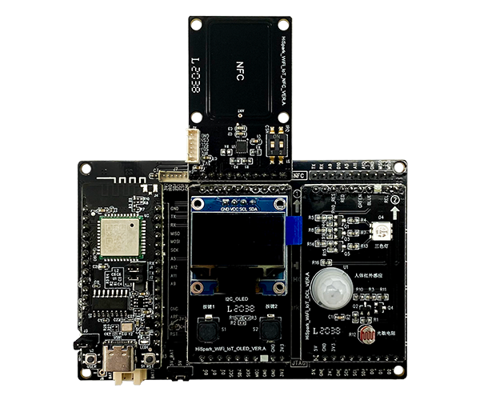
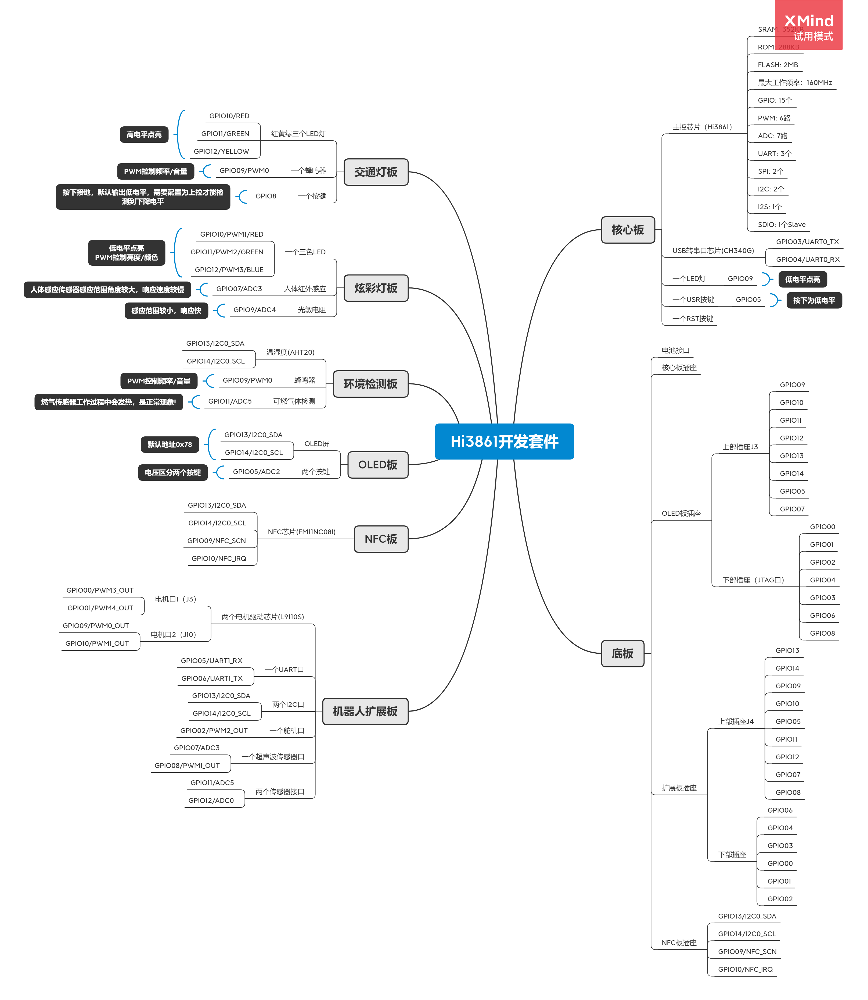

# HiSpark Wi-Fi IoT开发板指南

## 3816资源
显示板 OLED
NFC 
智能红绿灯板 三个LED灯/光敏电阻/热释电红外传感器AS312
智能炫彩灯板 RGB灯/人体红外/光敏
环境监测板   AHT20(I2C 温湿度传感器)/MQ-2(气敏)/蜂鸣器
语音控制(讯飞API,android app)

## HiSpark Wi-Fi IoT开发板介绍 

高性价比Wi-Fi&蓝牙双模SoC模组。

支持标准802.11 b/g/n协议，内置完整TCP/IP协议栈，集成蓝牙基带处理器，支持BT/BLE4.2 协议采用SMD封装，可通过标准SMT设备实现产品快速生产，为客户提供高可靠性连接方式。

特别适合自动化、大规模、低成本的现代化生产方式，方便应用于各种物联网硬件终端场合。HiSpark Wi-Fi IoT智能家居套件基于华为海思Hi3861芯片，支持LiteOS、HarmonyOS，实现Wi-Fi IoT功能，广泛应用于常电智能家居（如白电、小家电、电工类）场景。

## 产品参数

| 配置     | 参数                                                         |
| -------- | ------------------------------------------------------------ |
| SoC      | 基于海思Hi3861/Hi3861L高度集成的2.4GHz Wi-Fi芯片 内部集成高性能32bit微处理器、硬件安全引擎以及丰富的外设接口 |
| 操作系统 | 支持Lite OS、HarmonyOS和第三方组件，可与华为Hi-Link协同      |
| 通信能力 | 支持复杂环境下TPC、自动速率、弱干扰免疫等可靠性通信算法      |
| 组网能力 | 支持256节点Mesh组网 支持20MHz标准带宽和5MHz/10MHz窄带宽，提供最大72.2Mbit/s物理层速率 |
| 网络能力 | 支持IPv4 /IPv6 /DHCPv4 /DHCPv6 Client /Server/DNS Client /mDNS /CoAP /MQTT /HTTP /JSON 集成IEEE 802.11b/g/n基带和RF电路 Wi-Fi基带支持正交频分复用（OFDM） |
| 安全能力 | 支持AES128/256加解密/HASH-SHA256/HMAC_SHA256 /RSA 支持ECC签名校验算法 真随机数生成，满足FIPS140-2随机测试标准 支持TLS/DTLS加速 内部集成EFUSE、安全存储、安全启动、硬件ID |

## 原理图

[原理图pdf](原理图)

## 安装手册

[安装手册pdf](InstallationGuide/Pegasus智能家居安装指导手册.pdf)

## 参考文档

1. [产品参数](#产品参数)
2. Linux系统[源码下载和编译](https://gitee.com/hihope_iot/docs/blob/master/HiSpark_WiFi_IoT/Software/OpenHarmony%E8%BD%BB%E9%87%8F%E5%9E%8B%E8%AE%BE%E5%A4%87%E5%BC%80%E5%8F%91%E5%85%A5%E9%97%A8.pdf)
3. Windows系统[源码编辑和烧录环境, DevEco Device Tool 安装配置](https://gitee.com/hihope_iot/docs/blob/master/HiSpark_WiFi_IoT/Software/DevEco_Device_Tool_install.md)
4. [HiBurn烧录固件到开发板](https://gitee.com/hihope_iot/docs/blob/master/HiSpark_WiFi_IoT/Software/Use_HiBurn_download_firmware.md)
5. [相关课程以及代码样例](https://gitee.com/hihopeorg/HarmonyOS-IoT-Application-Development)
6. [润和满天星系列Pegasus智能家居OpenHarmony开发套件资料汇总](https://gitee.com/hihope_iot/HiHope_Pegasus_Doc)
